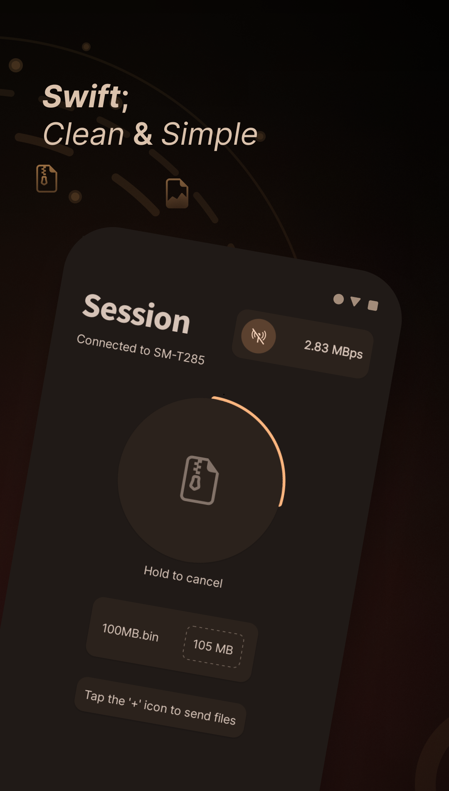
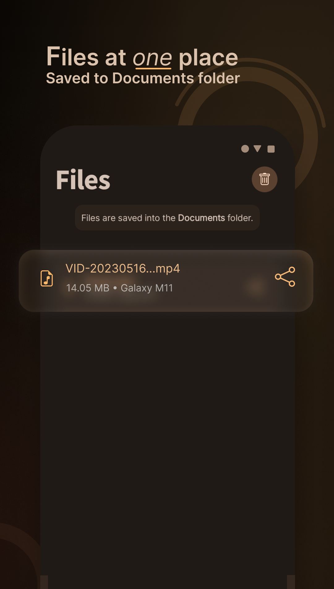

    
    <h1>Floats</h1>
    
Free and open-source Android app for file sharing on local networks.

# Features

- Simple and clean UI
- Simply scan the QR to connect
- Reliable: The files get transferred without disruption
- Provides a simple UI to view and share the transferred files

## Installation

You can download the latest APK from the releases.

## Contribution

Open for contributions :) 
You are welcomed to contribute, fix bugs, add features etc.

Thanks, 
Kumaraswamy